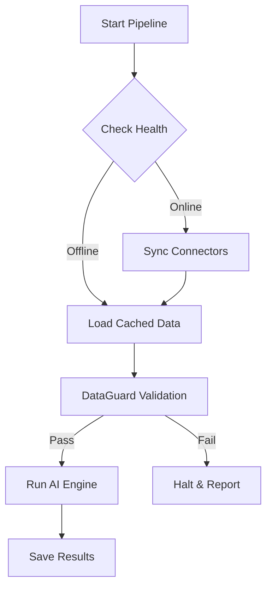

# Data Ingestion & Resilience Architecture

**Last Updated:** February 2026
**Architecture Tier:** Core & Enterprise

## 1. Overview ("Guaranteed Delivery")

The Tactics ingestion layer is built on a "Defense-in-Depth" philosophy. It allows the system to remain operational even when external APIs (Meta, Shopify) or internal databases (Supabase) experience outages.

### Key Components
1.  **Connectors**: Specialized adapters for each data source.
2.  **Resilience Layer**: Circuit Breakers and Retry policies.
3.  **Persistence**: Local SQLite cache for offline mode.
4.  **Quality**: DataGuard validation before processing.

---

## 2. Connector Ecosystem

We ingest data from three primary pillars to form a 360° view of the business.

### A. Cost (Ad Spend)
- **Meta Ads**: Daily spend, impressions, clicks.
- **Google Ads**: Search & YouTube campaign performance.
- **Circuit Breakers**: `meta_breaker`, `google_breaker`

### B. Traffic (Behavior)
- **Google Analytics 4**: Sessions (Traffic Volume) and Conversions.
- **Google Search Console**: Organic keywords and SEO health.
- **Circuit Breakers**: `ga4_breaker`, `gsc_breaker`

### C. Revenue (Conversion & Audit)
- **Shopify**: Orders, Customers, Products (Gross Revenue).
- **Klaviyo**: Email subscribers and attributed revenue (Owned Media).
- **Stripe**: Financial transactions and net revenue (Financial Truth).
- **Circuit Breakers**: `shopify_breaker`, `klaviyo_breaker`, `stripe_breaker`

---

## 3. Resilience Mechanisms

### Circuit Breakers
Prevents cascading failures. If an API fails 5 times consecutively, the breaker "Opens" for a cooling period (e.g., 300s), instantly failing subsequent calls without hitting the external service.

### Dead Letter Queue (DLQ)
Failed database writes are never lost.
1.  **Retry Queue**: Failed writes are saved to local SQLite.
2.  **Background Process**: Periodically attempts to flush the queue.
3.  **Dead Letter**: After 3 failed retries, items move to DLQ for manual inspection.

### DataGuard
A quality firewall that runs *after* ingestion but *before* processing.
- **Sales Check**: Ensures no negative revenue or missing dates.
- **Marketing Check**: Verifies channel consistency.
- **Action**: detailed error report in `pipeline_result`.

---

## 4. Pipeline Execution Flow

## 5. Monitoring
System health can be monitored in real-time at:
- **UI**: `/app/system-health`
- **API**: `/api/health/system`
